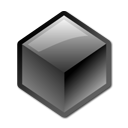

<meta content="text/html; charset=UTF-8" http-equiv="Content-Type">
<meta name="keywords" content="disk encryption, security, transparent, AES, OTFE, plausible deniability, virtual drive, Linux, MS Windows, portable, USB drive, partition">
<meta name="description" content="DoxBox: An Open-Source transparent encryption program for PCs. With this software, you can create one or more &quot;DoxBoxes&quot; on your PC - which appear as disks, anything written to these disks is automatically encrypted before being stored on your hard drive.">

<meta name="author" content="Sarah Dean">
<meta name="copyright" content="Copyright 2004, 2005, 2006, 2007, 2008 Sarah Dean">
<meta name="ROBOTS" content="ALL">

<TITLE>Known Bugs</TITLE>

<link href="./styles_common.css" rel="stylesheet" type="text/css">

<link rel="shortcut icon" href="../src/Common/Common/images/DoxBox.ico" type="image/x-icon">

_[DoxBox](http://DoxBox.squte.com/): Open-Source disk encryption for Windows_

***

      
            
## Known Bugs

<UL>

  * LUKS volumes which use the Tiger hash cannot be mounted correctly

</UL>
Both of the above issues are currently under investigation, and should be fixed in a later version

If you believe that you have found a bug in DoxBox, it would be **very much appreciated** if you could get in touch and report it; please see the section on: [Fault/Bug Reporting](fault_reporting.md)

